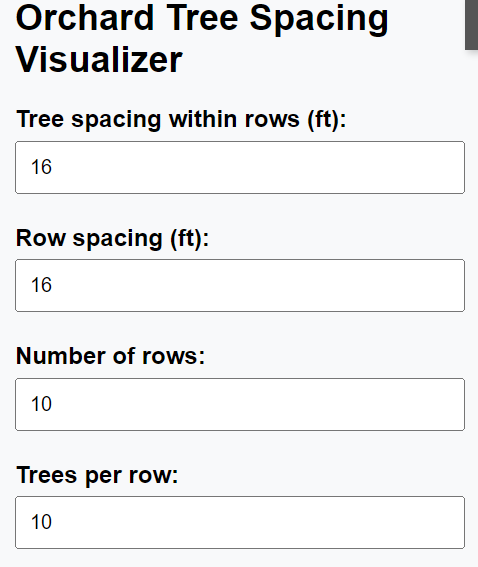
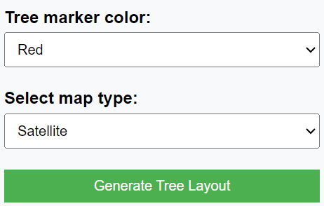
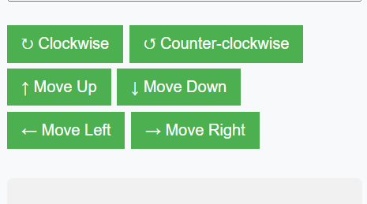
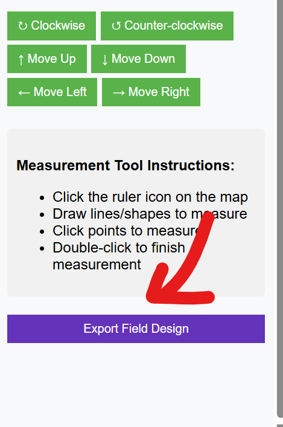
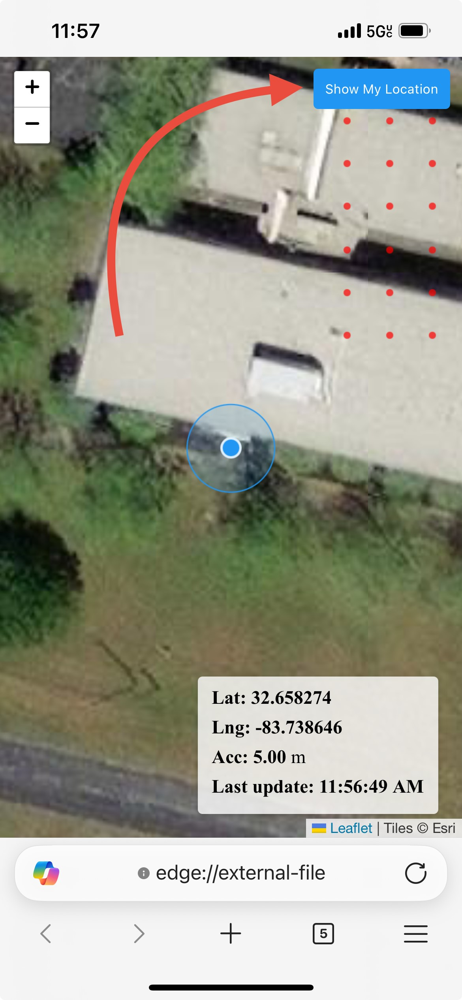

# Orchard Tree Visualizer webapp
## About
This is a tool that allows you to visualize an orchard planting on a map.
(Caution: this tool is still under Development, features needed is more accurate GPS)
Current version: must use iOS browser to use the tool to full capacity.

## Suggested requirments
- Computer with internet connection to design field
- iOS device with internet connection to use location services in field
- Bad Elf gps unit (developed using Bad Elf Flex Mini)

## General
Primary use of the tool is to visualize the planting plan of the orchard and see if it fits the topographical features such as ditches and such. Development of the tool was based out of necessity to see how my new orchard would fit in a weird trapezoidal shaped parcel of land.      

## Usage
In the left side bar, you can input the parameter of the field. Make sure your rows and plants per row is greater than the number of plants you are planning to plant.      

<kbd> </kbd>

You can also choose the colors of the dots representing the trees and what kind of map (satellite view is default)       

You are able to move the orchard up, down, left, right, and then spin it clockwise and counter clockwise       

After you have finished your orchard, you can export the data to an html file. This html file is a simplified verion of the webapp which will allow you to view the orchard in a browser. (Caution: only iOS browswer and html created can only be opened in microsoft edge on iOS).    

## Suggested workflow
1. Use the tool to plan the orchard on a computer. Does not matter if windows, mac, or linux. https://jeekinlau.github.io/tree_visualizer/

2. Move the orchard to the field and use the move buttons to see how it fits in your field. NOTE: the tool up, down, left, right are based off the initial position of the orchard. If you rotate the orchard, the up, down, left, right will be based off the rotated position.

3. Once you are satisfied with the orchard, export the data to an html file. This html file is a simplified verion of the webapp which will allow you to view the orchard in a browser. Email yourself the html file to yourself and open with iPad or iPhone that is linked up to internet, and a Bad Elf gps unit.

4. On the exported html file, click the "Show My Location" button. This will let you know your relative location to the trees you have designed.     

