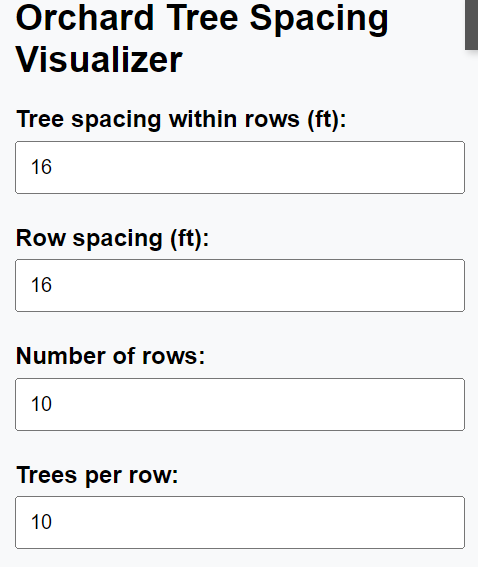
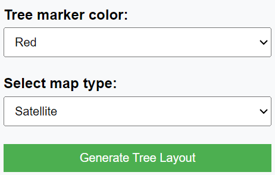
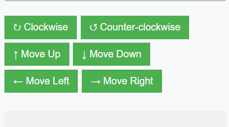
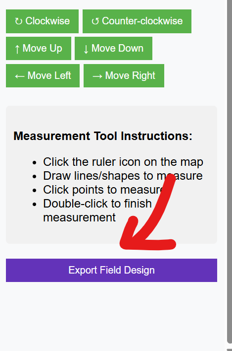
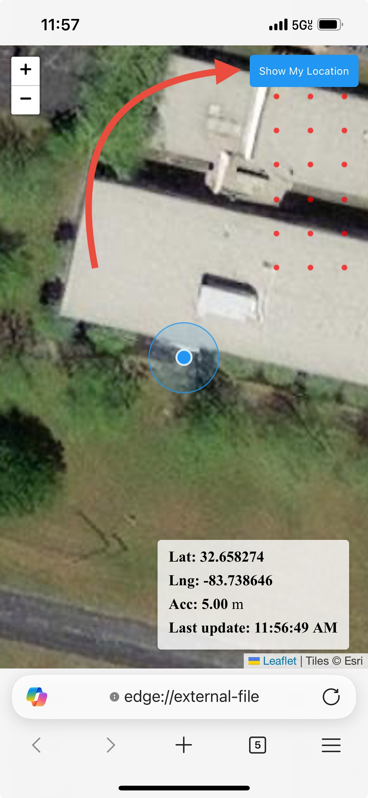

# Orchard Tree Visualizer webapp

## About
This is a tool that allows you to visualize an orchard planting on a map.
**Current version**: Works on modern browsers including iOS Safari, Chrome, Firefox, and Android browsers with GPS/location services.

## Features
- **Interactive Map Design**: Plan your orchard layout on satellite or street map views
- **GPS Tracking**: Real-time location tracking with accuracy display
- **Mobile Responsive**: Optimized for both desktop and mobile devices
- **Offline Ready**: Progressive Web App (PWA) that can be installed on mobile devices
- **Settings Persistence**: Your configuration is automatically saved
- **Measurement Tools**: Built-in distance measurement for field planning
- **Export Functionality**: Export your design for field use

## Supported Platforms
- **Desktop**: Windows, macOS, Linux (Chrome, Firefox, Safari, Edge)
- **Mobile**: iOS 12+ (Safari, Chrome), Android 8+ (Chrome, Firefox, Samsung Internet)
- **GPS Requirements**: 
  - iOS: Works with built-in GPS or external GPS units (e.g., Bad Elf)
  - Android: Works with built-in GPS
  - Desktop: Works with browser-based location services where available

## Suggested requirements
- Computer or tablet with internet connection to design field
- Mobile device with internet connection and GPS for field use
- Optional: External GPS unit for improved accuracy (developed using Bad Elf Flex Mini)

## General
Primary use of the tool is to visualize the planting plan of the orchard and see if it fits the topographical features such as ditches and such. Development of the tool was based out of necessity to see how my new orchard would fit in a weird trapezoidal shaped parcel of land.      

## Usage
In the left side bar, you can input the parameter of the field. Make sure your rows and plants per row is greater than the number of plants you are planning to plant.      

<kbd> </kbd>

You can also choose the colors of the dots representing the trees and what kind of map (satellite view is default)       

<kbd></kbd>

You are able to move the orchard up, down, left, right, and then spin it clockwise and counter clockwise       

<kbd></kbd>

After you have finished your orchard, you can export the data to an html file. This html file is a simplified verion of the webapp which will allow you to view the orchard in a browser. (Caution: only iOS browswer and html created can only be opened in microsoft edge on iOS).    

<kbd></kbd>

## Suggested workflow

### Desktop/Tablet Planning
1. Visit https://jeekinlau.github.io/tree_visualizer/ on any modern browser
2. Configure your orchard parameters:
   - Tree spacing within rows (feet)
   - Row spacing (feet)
   - Number of rows
   - Trees per row
   - Field rotation (degrees)
3. Click "Generate Tree Layout" to visualize your design
4. Use movement controls to position the orchard on the map
5. Your settings are automatically saved for future sessions

### Mobile Field Use
1. Export your design using the "Export Field Design" button
2. Save or email the exported HTML file to your mobile device
3. Open the file on your mobile device's browser
4. Enable location permissions when prompted
5. Click "Show My Location" to see your position relative to planned trees
6. For best accuracy on iOS, consider using an external GPS unit

### Installing as an App (PWA)
**iOS:**
1. Open the web app in Safari
2. Tap the Share button
3. Select "Add to Home Screen"
4. The app icon will appear on your home screen

**Android:**
1. Open the web app in Chrome
2. Tap the menu (⋮)
3. Select "Add to Home screen" or "Install app"
4. The app icon will appear on your home screen

## Tips for Best Results
- Start with satellite view to see actual field boundaries
- Use the measurement tool to verify distances
- Test GPS accuracy before heading to the field
- For mobile use, ensure location services are enabled
- External GPS units provide better accuracy than phone GPS
- The app works offline once loaded (PWA feature)     

<kbd></kbd>

